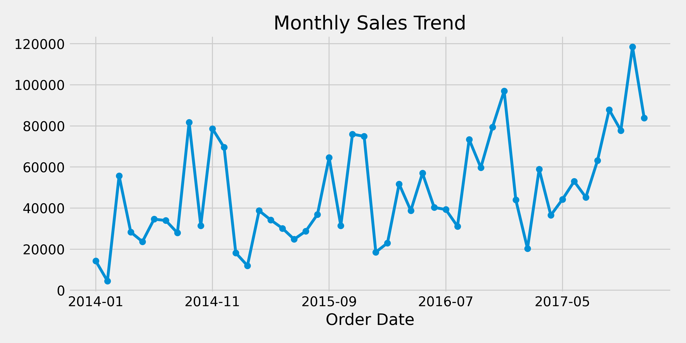
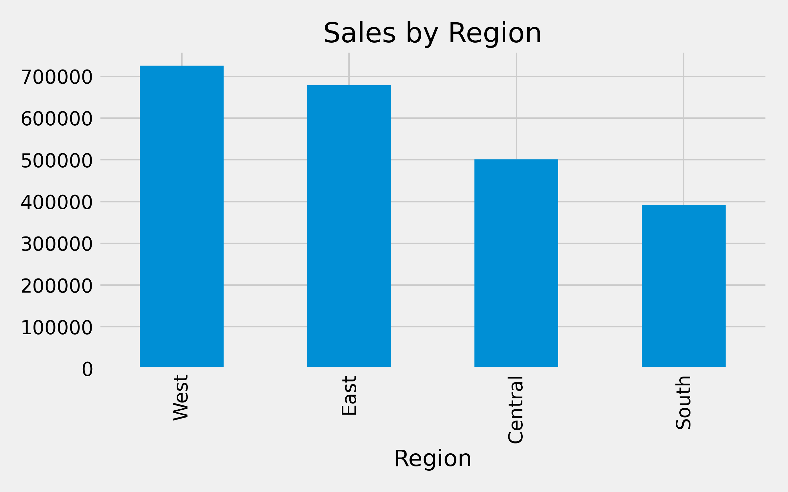
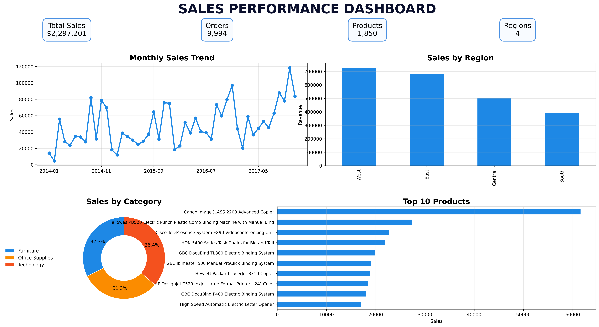

# Sales Performance Dashboard using Python

## Overview

The Sales Performance Dashboard is a data analytics project that transforms raw retail sales data into meaningful business insights. Using Python, Pandas, and Matplotlib, the project performs data cleaning, exploratory data analysis (EDA), aggregation, and visualization to help stakeholders understand sales performance and make informed decisions.

This project demonstrates the complete workflow of a Data Analyst, from handling raw datasets to presenting actionable insights through visual dashboards.

---

## Project Objectives

* Analyze retail sales data to identify trends and patterns.
* Evaluate sales performance across different regions.
* Identify top-performing products and categories.
* Track monthly sales growth and seasonality.
* Present findings through professional visualizations.

---

## Technologies Used

* Python
* Pandas
* NumPy
* Matplotlib
* Jupyter Notebook
* Git & GitHub

---

## Project Structure

```text
sales-performance-dashboard-python/
│
├── data/
│   └── sales.csv
│
├── images/
│   ├── monthly_sales.png
│   ├── region_sales.png
│   ├── category_sales.png
│   └── sales_dashboard.png
│
├── notebooks/
│   └── sales_analysis.ipynb
│
├── dashboard.py
├── requirements.txt
└── README.md
```

---

## Dataset

The project uses a public retail sales dataset containing:

* Order Date
* Product Name
* Category
* Region
* Sales
* Profit
* Customer Segment

Dataset Source:
Replace this section with the dataset link used in your project.

---

## Data Processing Workflow

### 1. Data Loading

* Import dataset using Pandas
* Inspect structure and data types

### 2. Data Cleaning

* Handle missing values
* Remove duplicate records
* Convert date columns
* Validate data consistency

### 3. Feature Engineering

* Extract month and year from order dates
* Create analysis-ready fields

### 4. Data Analysis

* Total sales calculation
* Sales by region
* Sales by category
* Top-performing products
* Monthly sales trends

### 5. Data Visualization

* Line charts
* Bar charts
* Pie charts
* Dashboard summary view

---

## Dashboard Insights

The dashboard answers key business questions:

### Regional Performance

Which regions generate the highest revenue?

### Product Analysis

Which products contribute the most sales?

### Category Analysis

Which categories drive overall business growth?

### Sales Trends

How does revenue change over time?

### Seasonal Patterns

Which months experience peak sales?

---

## Sample Visualizations

### Monthly Sales Trend



### Sales by Region



### Complete Dashboard



---

## Key Skills Demonstrated

* Data Cleaning
* Exploratory Data Analysis (EDA)
* Data Aggregation
* Business Analytics
* Data Visualization
* Dashboard Development
* Insight Generation
* Python Programming

---

## Business Insights

Example findings from the analysis:

* Top-performing region contributes the highest percentage of total revenue.
* Technology products generate significant sales volume.
* Year-end months show increased customer purchasing activity.
* A small group of products accounts for a large share of revenue.

---

## Future Enhancements

* Interactive dashboards using Plotly
* Integration with SQL databases
* Sales forecasting using Machine Learning
* Weather vs Sales correlation analysis
* Power BI dashboard version

---

## How to Run

1. Clone the repository

```bash
git clone https://github.com/yourusername/sales-performance-dashboard-python.git
```

2. Navigate to the project folder

```bash
cd sales-performance-dashboard-python
```

3. Install dependencies

```bash
pip install -r requirements.txt
```

4. Run the analysis notebook or dashboard script

```bash
python dashboard.py
```

---

## Author

Virang Raje

Project for Data Analytics using Python 

---

## Project Purpose

This project was created to demonstrate practical data analytics skills including data cleaning, transformation, analysis, visualization, and business reporting using Python.

